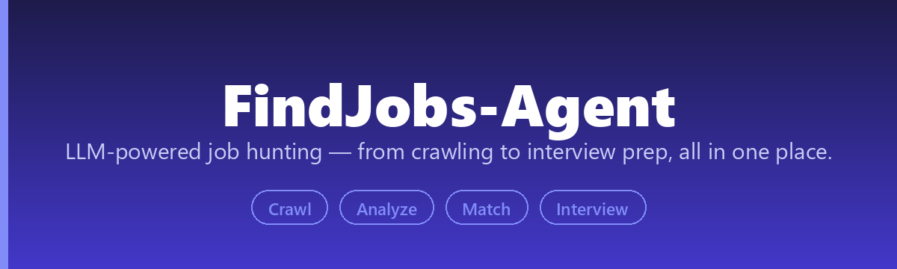
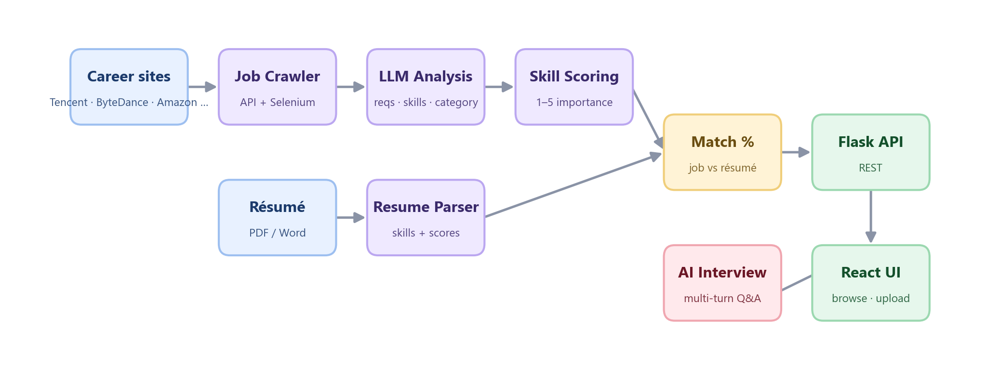

<div align="center">



[](https://www.python.org/downloads/)
[](LICENSE)
[](https://github.com/he-yufeng/FindJobs-Agent/actions/workflows/ci.yml)

**[English](README.md) · [中文](README_CN.md)** &nbsp;·&nbsp; [快速开始](#快速开始) · [工作流程](#工作流程) · [核心功能](#核心功能)

</div>

---

## 简介

一个集成了岗位数据爬取、LLM 智能分析、简历解析和 AI 模拟面试的全栈求职辅助系统。

## 工作流程

四块拼成一条链路：爬虫从各公司招聘页抓岗位，LLM 逐条读出岗位要求和技能，简历解析后跟这些要求打分匹配，任意一个岗位都能拿它的 JD 直接发起一场 AI 模拟面试。React 前端把这几步串起来，让你从「外面有哪些岗」一路走到「我来练练这家」，全程不用离开应用。



## 核心功能

- **智能岗位爬虫** — 从腾讯、网易、字节跳动、Amazon 等抓取岗位，支持 API 与 Selenium 双模式，自动清洗和标准化。
- **LLM 智能分析** — 自动提取学历/专业要求，给技能标签打重要性分（1-5），并按岗位族谱分类。
- **简历解析与匹配** — 解析 PDF/Word 简历、给技能打分，算出不区分大小写的岗位-简历匹配度。
- **AI 模拟面试** — 基于任意岗位 JD 生成针对性问题，多轮对话面试并实时反馈。

## 项目结构

```
FindJobs-Agent/
├── FrontEnd/                # React 前端
│   ├── src/
│   │   ├── components/      # 页面组件
│   │   │   ├── JobsPage.tsx       # 岗位浏览
│   │   │   ├── ResumePage.tsx     # 简历分析
│   │   │   └── InterviewPage.tsx  # AI 面试
│   │   └── App.tsx
│   └── package.json
├── job_crawler_v2.py        # 多公司爬虫（主力）
├── job_crawler_selenium.py  # Selenium 爬虫
├── job_agent.py             # LLM 岗位分析 Agent
├── pipeline.py              # 数据处理流水线
├── api_server.py            # Flask API 服务
├── interview_agent.py       # AI 面试模块
├── resume_parser.py         # 简历解析
├── tag_rate.py              # 技能评分
├── llm_client.py            # LLM 客户端
├── tech_taxonomy.json       # 岗位分类体系
├── all_labels.csv           # 技能标签库
└── requirements.txt
```

## 快速开始

### 环境要求
- Python 3.9+
- Node.js 18+
- Chrome 浏览器（Selenium 爬虫需要）

### 1. 克隆项目
```bash
git clone https://github.com/he-yufeng/FindJobs-Agent.git
cd FindJobs-Agent
```

### 2. 安装后端依赖
```bash
pip install -r requirements.txt
```

### 3. 配置 API Key
创建 `API_key.md` 文件，填入你的 OpenAI API Key：
```
sk-your-api-key-here
```

### 4. 启动后端服务
```bash
python api_server.py
```

### 5. 启动前端
```bash
cd FrontEnd
npm install
npm run dev
```

### 6. 访问应用
打开浏览器访问 http://localhost:8080

## 数据处理流程

`pipeline.py` 把爬取 → 分析 → 评分 → 展示串成一条链路。可以整条跑，也可以只跑某一步：

```bash
python pipeline.py                                          # 爬取 + 分析 + 生成网站数据
python job_crawler_v2.py -c tencent netease amazon -m 300   # 仅爬取（--list 查看支持的公司）
python pipeline.py --analyze-only --max-jobs 50             # 仅分析（测试）
```

## API 接口

| 接口 | 方法 | 说明 |
|------|------|------|
| `/api/jobs` | GET | 获取岗位列表 |
| `/api/jobs/<id>` | GET | 获取岗位详情 |
| `/api/resume/upload` | POST | 上传简历 |
| `/api/resume/analyze` | POST | 分析简历 |
| `/api/interview/start` | POST | 开始面试 |
| `/api/interview/answer` | POST | 提交答案 |

## 后续规划

爬取、分析、简历匹配、模拟面试已经能跑通整条链路，接下来想把入口拓宽、把求职跟到匹配之后：

- **更多岗位来源**：把爬虫从当前的公司列表扩展到招聘平台和聚合站，让匹配不再局限于固定名单。
- **增量爬取**：记录已经见过的岗位，只抓新发布的，而不是每次重爬、重分析全量。
- **投递进度跟踪**：一个简单看板记录每份投递的状态（已投 / 已回 / 面试），让工具一直跟到匹配之后。
- **语音模拟面试**：给 AI 面试官加上语音输入输出，比纯文字聊天更接近真实面试。

## 相关项目

FindJobs-Agent 是我做的应用级 agent 之一，下面几个也许对你有用：

- **[CoreCoder](https://github.com/he-yufeng/CoreCoder)** — 想搞懂一个 coding agent 到底怎么运作？把整套约 1000 行引擎从头读到尾，而不是当黑箱。
- **[RepoWiki](https://github.com/he-yufeng/RepoWiki)** — 被丢进一个陌生代码库？它给你一份带「从哪读起」路径的 wiki，一个可自托管的 DeepWiki 替代。
- **[ContractGuard](https://github.com/he-yufeng/ContractGuard)** — 签字前先把有风险的条款挑出来：它读合同、标出危险点。
- **[GitSense](https://github.com/he-yufeng/GitSense)** — 想给开源做贡献？它帮你找到值得做的 issue，还能估你的 PR 多大概率被合。
- **[CodeABC](https://github.com/he-yufeng/CodeABC)** — 不会写代码也能看懂一个项目，专给小白做的。

## 贡献

欢迎提交 Issue 和 Pull Request！

## 许可证

MIT License
