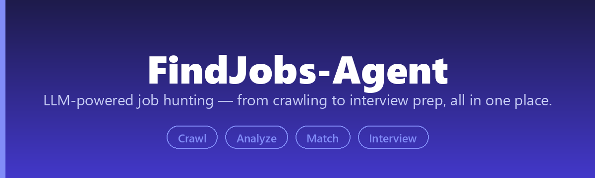
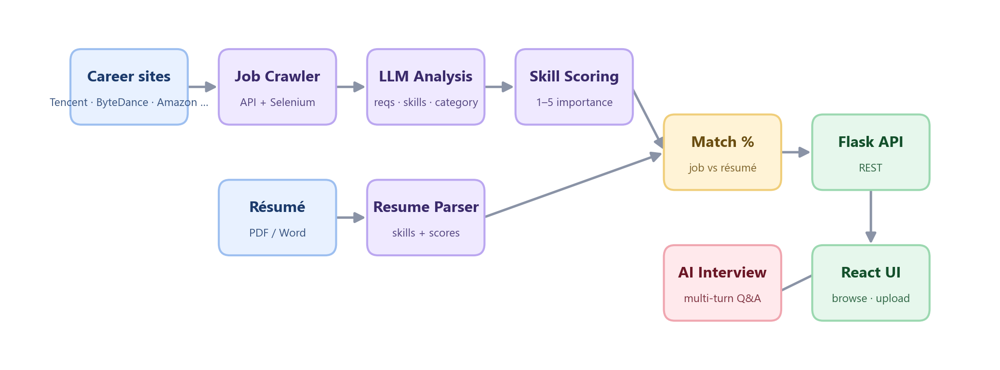

<div align="center">



[](https://www.python.org/downloads/)
[](LICENSE)
[](https://github.com/he-yufeng/FindJobs-Agent/actions/workflows/ci.yml)

**[English](README.md) · [中文](README_CN.md)** &nbsp;·&nbsp; [两分钟演示](#两分钟跑个演示demo-模式) · [快速开始](#快速开始) · [工作流程](#工作流程) · [核心功能](#核心功能)

</div>

---

## 简介

一个集成了岗位数据爬取、LLM 智能分析、简历解析和 AI 模拟面试的全栈求职辅助系统。

## 两分钟跑个演示（Demo 模式）

不想先配 API Key，也能把整套流程完整跑一遍。Demo 模式完全离线：

```bash
pip install -r requirements.txt
FINDJOBS_DEMO=1 python api_server.py        # 后端 :5000，数据库为空时自动写入示例岗位
cd FrontEnd && npm install && npm run dev   # 前端 :8080
```

Demo 模式具体做的事：启动时如果 `jobs.db` 是空的，就从 `data/sample_jobs.json` 写入 54 条手工编写的示例岗位（覆盖爬虫支持的那些公司）；所有 LLM 调用改走 `demo_llm.py` 里的确定性离线桩，根据 prompt 内容生成回答，不发任何网络请求，即使本地已经配了 Key。在简历页直接上传仓库自带的 `data/sample_resume.pdf`，就能把简历解析、岗位匹配、三阶段模拟面试和投递看板整条链路体验一遍。后端以 Demo 模式运行时，导航栏会多出一个「Demo」小标记。

两个演示数据文件都可以重新生成：`python scripts/seed_demo_data.py` 和 `python scripts/make_sample_resume.py`。

## 工作流程

四块拼成一条链路：爬虫从各公司招聘页抓岗位，LLM 逐条读出岗位要求和技能，简历解析后跟这些要求打分匹配，任意一个岗位都能拿它的 JD 直接发起一场 AI 模拟面试。React 前端把这几步串起来，让你从「外面有哪些岗」一路走到「我来练练这家」，全程不用离开应用。



## 核心功能

- **智能岗位爬虫** — 从腾讯、网易、字节跳动、Amazon 等抓取岗位，支持 API 与 Selenium 双模式，自动清洗和标准化。
- **LLM 智能分析** — 自动提取学历/专业要求，给技能标签打重要性分（1-5），并按岗位族谱分类。
- **简历解析与匹配** — 解析 PDF/Word 简历、给技能打分，算出不区分大小写的岗位-简历匹配度。
- **AI 模拟面试** — 基于任意岗位 JD 生成针对性问题，多轮对话面试并实时反馈。
- **Demo 模式**：设 `FINDJOBS_DEMO=1` 即可离线跑通整个应用，示例岗位、内置示例简历、确定性桩 LLM 都备好了，不需要付费 Key。
- **SQLite 持久化** — 分析结果写入本地 `jobs.db`，首次启动自动迁移已有的 CSV 数据，数据库为空时回退原 CSV/JSON 路径。上传的简历和模拟面试记录也存在同一个库里，重启 API 服务不再丢失。

## 项目结构

```
FindJobs-Agent/
├── FrontEnd/                # React 前端
│   ├── src/
│   │   ├── components/      # 页面组件
│   │   │   ├── JobsPage.tsx       # 岗位浏览
│   │   │   ├── ResumePage.tsx     # 简历分析
│   │   │   └── InterviewPage.tsx  # AI 面试
│   │   └── App.tsx
│   └── package.json
├── findjobs/                # 包本体：爬虫、匹配、简历、面试、流水线
│   ├── pipeline.py          # 主流水线，也是 `findjobs` CLI 入口
│   ├── job_agent.py         # LLM 岗位分析 Agent
│   ├── api_server.py        # Flask API 服务
│   ├── storage.py           # SQLite 存储：岗位、投递状态、简历、面试记录（jobs.db）
│   ├── interview_agent.py   # AI 面试模块
│   ├── resume_parser.py     # 简历解析
│   └── ...                  # 爬虫、评分、LLM 客户端、demo 桩
├── data/                    # 标签库 + 岗位分类体系 + 演示数据
├── config/                  # llm_config.json 与部署配置
├── docs/                    # API 参考与项目文档
├── scripts/                 # 辅助脚本：演示数据写入、示例简历生成、爬虫冒烟测试
├── tests/                   # pytest 测试
├── pyproject.toml
└── requirements.txt
```

## 快速开始

### 环境要求
- Python 3.9+
- Node.js 18+
- Chrome 浏览器（Selenium 爬虫需要）

### 1. 克隆项目
```bash
git clone https://github.com/he-yufeng/FindJobs-Agent.git
cd FindJobs-Agent
```

### 2. 安装后端依赖
```bash
pip install -r requirements.txt
```

### 3. 配置 API Key
创建 `API_key.md` 文件，填入你的 OpenAI API Key：
```
sk-your-api-key-here
```

### 4. 启动后端服务
```bash
python api_server.py
```

### 5. 启动前端
```bash
cd FrontEnd
npm install
npm run dev
```

### 6. 访问应用
打开浏览器访问 http://localhost:8080

## 数据处理流程

`pipeline.py` 把爬取 → 分析 → 评分 → 展示串成一条链路。可以整条跑，也可以只跑某一步：

```bash
python pipeline.py                                          # 爬取 + 分析 + 生成网站数据
python job_crawler_v2.py -c tencent netease amazon -m 300   # 仅爬取（--list 查看支持的公司）
python pipeline.py --analyze-only --max-jobs 50             # 仅分析（测试）
```

另有一个可选的聚合源：[freehire.me](https://freehire.me) 是开源 IT 职位聚合站，公开 API 免 key，搜索结果自带完整 markdown JD 和公司官方 ATS 投递链接，不用二次抓详情页。默认关闭，用 `--freehire` 打开，也可以单独跑：

```bash
python pipeline.py --freehire --freehire-query "backend"      # 公司爬虫之外再拉 freehire
python freehire_source.py -q "ml engineer" --skills python,pytorch --countries us,de -m 100
python freehire_source.py --list-facets skills                # 查看实时筛选词表（skill slug、国家码等）
```

筛选词表（技能 slug、国家码、枚举值）运行时从 `/api/v1/jobs/facets` 拉取，代码里不硬编码。

### 岗位数据来源

爬虫收录了 32 家企业（`--list` 可查），全部走各家招聘官网面向求职者的公开职位 API，不需要登录、不需要 key、不绕反爬。

最近一次全量刷新（2026-09）验证下来，4 家是活源：

| 来源 | 接口 | 说明 |
|------|------|------|
| 腾讯 | `careers.tencent.com` 查询 API | 单次最多拉 400 条 |
| 字节跳动 | `jobs.bytedance.com` 门户 API | 已切到现在的 POST 请求格式，旧的 GET 已失效 |
| 网易 | 公开搜索 API | 社招 + 校招 |
| Amazon | `amazon.jobs` 搜索 API | 全球岗位，支持按国家过滤 |

`data/latest_jobs.json` 是最近一次抓取的快照，共 1,187 条岗位（以上 4 家），已提交进仓库，不重新爬也有真实数据可跑。

其余适配器（百度、快手、小米、哔哩哔哩、滴滴、拼多多、华为、携程、大疆、蔚来、小鹏、理想、OPPO、VIVO、商汤、米哈游、SHEIN、Shopee、贝壳、猿辅导、作业帮、智联、拉勾、Microsoft、Google）是照 2023 年的接口写的，这两年对方接口改了形态或开始拦裸请求，目前返回为空，需要逐个刷新适配。阿里、美团、京东走 `job_crawler_selenium.py`，要本机浏览器驱动。你正好需要其中某家，开个 issue，我优先修。

## API 接口

| 接口 | 方法 | 说明 |
|------|------|------|
| `/api/jobs` | GET | 获取岗位列表 |
| `/api/jobs/<id>` | GET | 获取岗位详情 |
| `/api/resume/upload` | POST | 上传简历 |
| `/api/resume/analyze` | POST | 分析简历 |
| `/api/interview/start` | POST | 开始面试 |
| `/api/interview/answer` | POST | 提交答案 |

## 后续规划

爬取、分析、简历匹配、模拟面试已经能跑通整条链路，接下来想把入口拓宽、把求职跟到匹配之后：

- **更多岗位来源**：把爬虫从当前的公司列表扩展到招聘平台和聚合站，让匹配不再局限于固定名单。
- **增量爬取**：记录已经见过的岗位，只抓新发布的，而不是每次重爬、重分析全量。
- **投递进度跟踪**：前端看板页记录每个岗位的投递状态（已收藏 / 已投递 / 有回复 / 面试中 / 已拿 Offer / 已拒绝），状态和备注即时保存，后端落在 SQLite 的 `/api/applications`。
- **语音模拟面试**：给 AI 面试官加上语音输入输出，比纯文字聊天更接近真实面试。

## 相关项目

FindJobs-Agent 是我做的应用级 agent 之一，下面几个也许对你有用：

- **[CoreCoder](https://github.com/he-yufeng/CoreCoder)** — 想搞懂一个 coding agent 到底怎么运作？把整套约 1000 行引擎从头读到尾，而不是当黑箱。
- **[RepoWiki](https://github.com/he-yufeng/RepoWiki)** — 被丢进一个陌生代码库？它给你一份带「从哪读起」路径的 wiki，一个可自托管的 DeepWiki 替代。
- **[ContractGuard](https://github.com/he-yufeng/ContractGuard)** — 签字前先把有风险的条款挑出来：它读合同、标出危险点。
- **[GitSense](https://github.com/he-yufeng/GitSense)** — 想给开源做贡献？它帮你找到值得做的 issue，还能估你的 PR 多大概率被合。
- **[CodeABC](https://github.com/he-yufeng/CodeABC)** — 不会写代码也能看懂一个项目，专给小白做的。

## 贡献

欢迎提交 Issue 和 Pull Request！

## 许可证

MIT License
